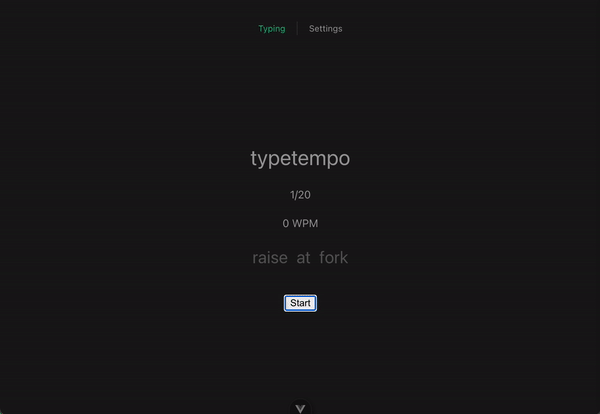

# typetempo

## Setup

This project requires a database. For convenience, a `docker-compose` file is included in this project that quickly sets up a database for local development.

From the root of this project run:

`docker compose up -d`

Then, run `pnpm i && pnpm db:push && pnpm dev` to start up the dev servers for both `api` and `web` projects.

### Apps, Packages, and file-structure

-   `api` backend api `express` server written in Typescript
-   `web` vue3 SPA frontend written in Typescript
-   `@typetempo/db`: shared `prisma` orm library for interacting with database
-   `@typetempo/config-eslint`: shared `eslint` configurations
-   `@typetempo/config-typescript`: `tsconfig.json`s used throughout the monorepo
-   `@typetempo/models`: common types and data structures used throught the monorepo

### Scripts

-   `db:push`: Pushes prisma schema to the database
-   `db:generate`: Regenerate the prisma client
-   `dev`: Startup `api` and `web` dev servers
-   `test:web` Run `web` unit tests

### Usage



-   Navigate to [http://localhost:5173/](http://localhost:5173/)
-   Click the "start" button. This will auto-focus a hidden input field.
-   Type the words you see on the screen.
-   The default test length is 20 words. After you reach the word limit, the test will automatically end.
-   Click "reset" to setup a new test. Click "start" to test again.

# Overview

## Goals

-   Create a typing app that measures your typing speed
-   Support multiple languages
-   Support configuring length of the test
-   Support tracking results history

## Thought Process

### Tech Stack

-   turborepo: monorepo scripting and caching
-   typescript
-   `vue3` for the frontend
    -   Wanted to experiment with vue since I've primarily been using React lately.
    -   Wanted to get more familiar with the composition API
-   `express` for the api server
    -   For now this server is implementing a very rudimentary auth flow.
        -   This was to just demo the ability for creating users from the frontend
    -   The goal would be to use a 3rd party service for auth
    -   This backend would really only exist to store user settings and user telemetry (like results from tests to measure their improvement over time).

### Data Structures

This application features some shared, and some workspace level data structures.
It was my goal to keep common data structures to both `api` and `web` apps in the `@typetempo/models` package. The idea is that `@typetempo/models` would be the one "source of truth" for any common data structures. Think of this as a place for structures such as users, settings, payloads, etc.

The `web` app has it's own workspace level data structures that are not shared with the `api`. These structures are used for creating UI elements. These can be found in `/apps/web/src/models`.

### Mission Critical Logic

The `web` app has unit tests for mission critical logic. Run `pnpm test:web` to check tests.
A good majority of the mission critical logic can be found in `/apps/web/src/stores/typingTest.ts`.

A function to examine in that file is the `calculateCompletedWords` function. It illustrates my approach of "parameter-izing" functions and testing them with dependency injection. The `typingTest` store is composed of many calculated values, which require testing to confirm data structures are computed as expected when a user is typing during a test.

## Areas of Improvement

### Authenticated Data Fetching

I'd like to setup a vue plugin for the vue app itself that handles making authenticated api calls to the api server. This can improve the DX of making api calls with a jwt bearer token without having to manually configure `fetch` for every network call. In theory, the plugin would store the token and user data after logging in by using a cookie. Then, when a network call is made, the plugin could automatically look for the cookie, parse the jwt from it, and then automatically configure a `fetch` request with the bearer token set to the parsed jwt.

### Storing User Settings

I'd like to setup persistent settings on a per-user basis.
The idea would be to:

1.  Use local storage as the frontend's "source of truth" for user settings
    -   Subsequent updates to settings simply change the "source of truth" that is stored in localstorage.
    -   Ideally, for this to work the best according to my mental model, I would need to figure out a way for vue to read local storage values as reactive state values.
2.  Listen for changes on the local storage settings, and if the user is authenticated, save those settings in a database
    -   On app init, the frontend can check if user is authenticated, and if so, pull settings from the database, then update the app's local storage with those settings.
    -   If user is not authenticate on init, settings can look for pre-existing settings in the localstorage, and if none are present, set settings to pre-configured defaults.

### Theming

Currently theme swapping isn't working. Ideally theming would work like this:

The core `css` file for the app would use css variables to configure the colors dictated by the current theme. All components throughout the app would simply reference the common css variables used in all themes. Themes are toggled by adding a data attribute to the `html` element.

E.g.

```css
:root {
    --color-primary: red;
    --color-background: white;
    --color-text: black;
}

[data-theme="dark"] {
    --color-primary: yellow;
    --color-background: black;
    --color-text: white;
}
```

### Form Validation

Authentication forms could use validation to enforce that a user is submitting a valid email and password.
